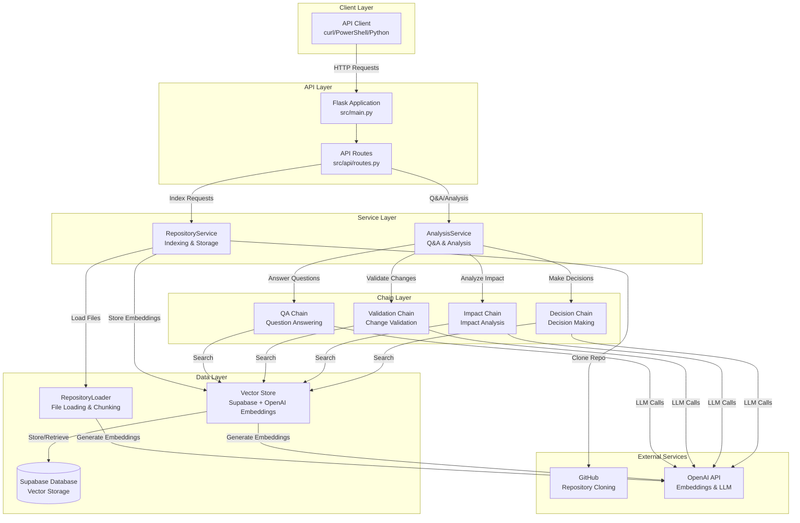
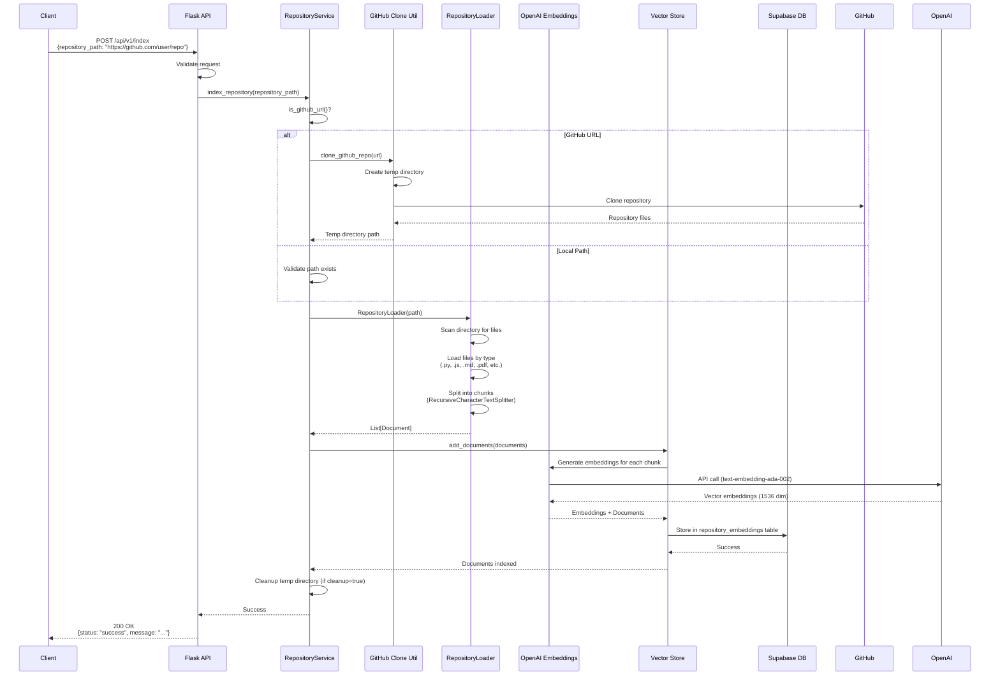
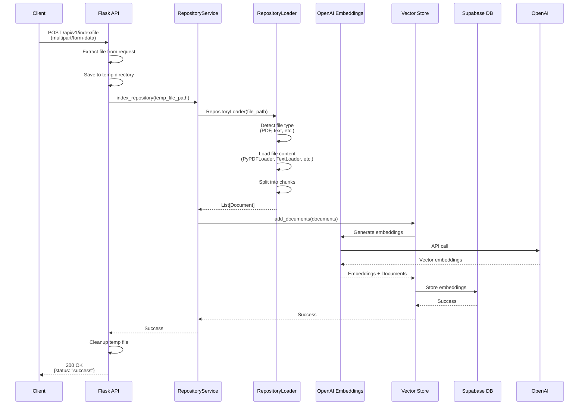
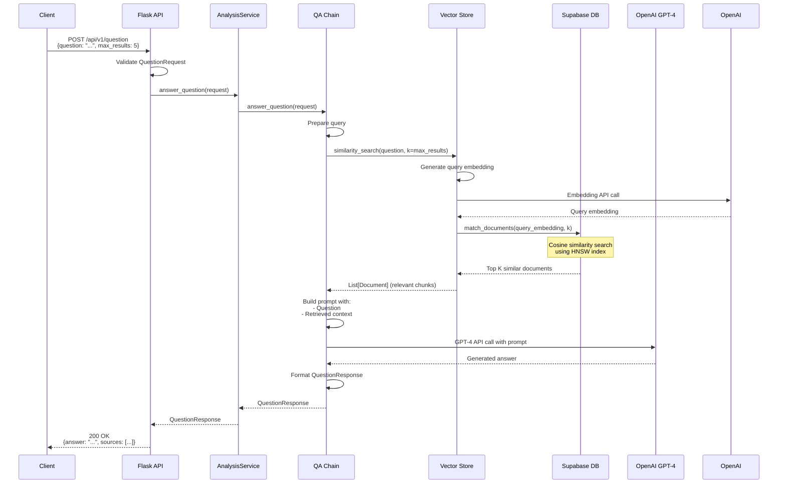
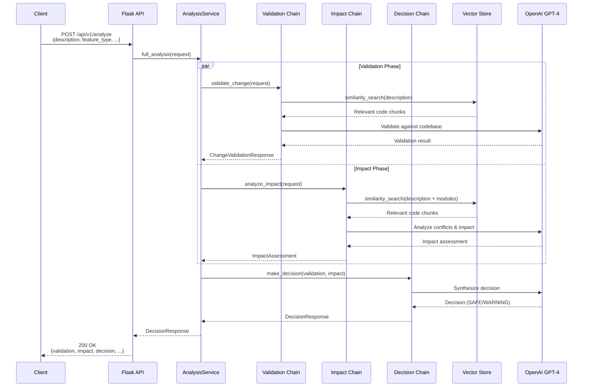
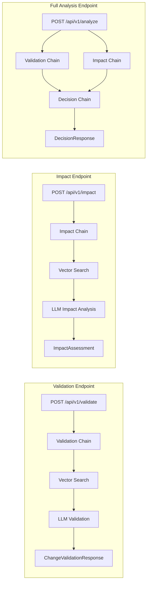
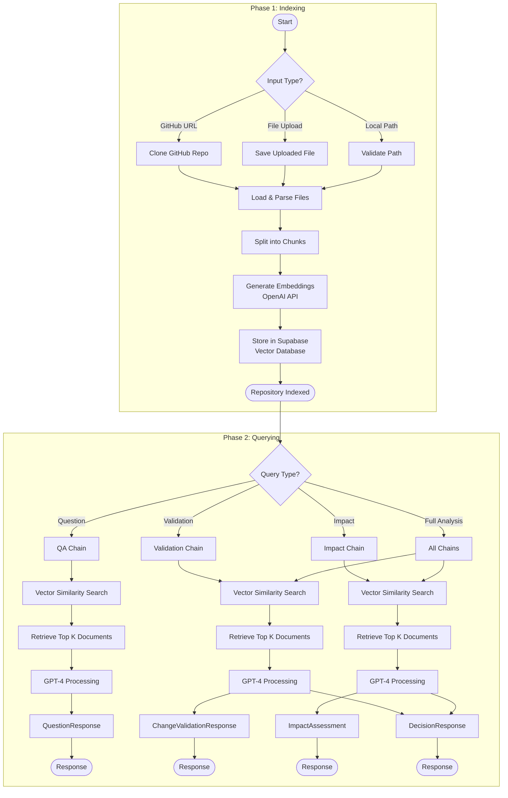
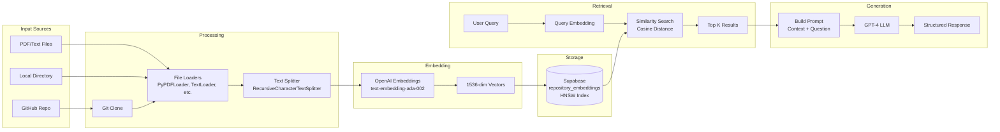
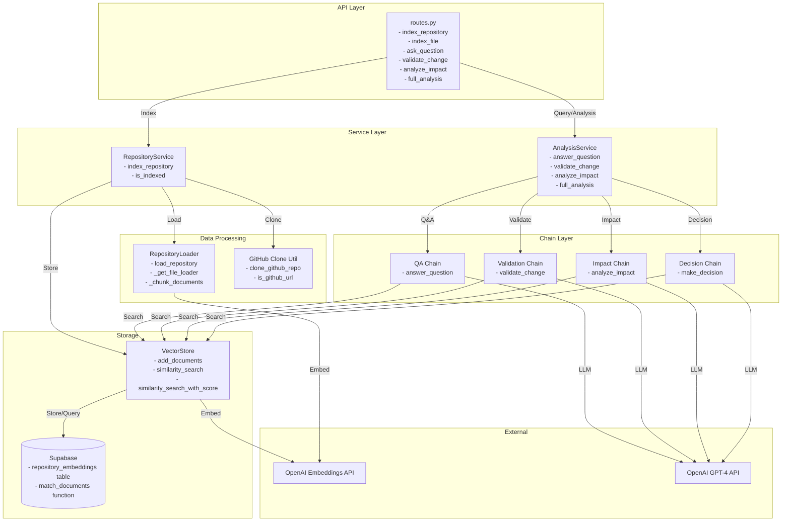

# System Flow Diagrams

Complete flow diagrams showing how the Repository Intelligence Backend works.

## Table of Contents

1. [System Architecture Overview](#system-architecture-overview)
2. [Repository Indexing Flow](#repository-indexing-flow)
3. [Question & Answer Flow](#question--answer-flow)
4. [Change Analysis Flow](#change-analysis-flow)
5. [Complete Request Flow](#complete-request-flow)

---

## System Architecture Overview



---

## Repository Indexing Flow

### GitHub Repository Indexing



### File Upload Indexing



---

## Question & Answer Flow



---

## Change Analysis Flow

### Full Analysis Flow (Validation + Impact + Decision)



### Individual Analysis Endpoints



---

## Complete Request Flow

### End-to-End Flow: From Indexing to Query



---

## Data Flow Diagram

### How Data Moves Through the System



---

## Component Interaction Diagram

### Detailed Component Interactions



---

## Key Components Summary

### 1. **Indexing Pipeline**
- **Input**: GitHub URL, file upload, or local path
- **Processing**: Clone (if GitHub) → Load files → Chunk text → Generate embeddings
- **Output**: Vector embeddings stored in Supabase

### 2. **Query Pipeline**
- **Input**: User question or change request
- **Processing**: Generate query embedding → Similarity search → Retrieve context → LLM generation
- **Output**: Structured response with answer/analysis

### 3. **Analysis Pipeline**
- **Input**: Change request description
- **Processing**: 
  - Validation: Check against existing codebase
  - Impact: Analyze conflicts and dependencies
  - Decision: Synthesize into SAFE/WARNING decision
- **Output**: Comprehensive analysis with recommendations

### 4. **Vector Search Process**
1. User query → Embedding generation (OpenAI)
2. Query embedding → Supabase similarity search
3. Cosine distance calculation using HNSW index
4. Return top K most similar document chunks
5. Use chunks as context for LLM

---

## Technology Stack Flow

```
┌─────────────────────────────────────────────────────────────┐
│                    Client Applications                       │
│  (curl, PowerShell, Python, JavaScript, Postman, etc.)        │
└───────────────────────┬───────────────────────────────────────┘
                        │ HTTP/REST
                        ▼
┌─────────────────────────────────────────────────────────────┐
│                    Flask Application                         │
│  - Flask Framework                                           │
│  - CORS Support                                              │
│  - Blueprint-based Routing                                   │
└───────────────────────┬───────────────────────────────────────┘
                        │
                        ▼
┌─────────────────────────────────────────────────────────────┐
│                    Service Layer                             │
│  - RepositoryService (Indexing)                              │
│  - AnalysisService (Q&A & Analysis)                         │
└───────────────────────┬───────────────────────────────────────┘
                        │
        ┌───────────────┴───────────────┐
        │                               │
        ▼                               ▼
┌──────────────────┐          ┌──────────────────┐
│  LangChain       │          │  LangChain       │
│  Chains          │          │  Loaders         │
│  - QA Chain      │          │  - TextLoader    │
│  - Validation    │          │  - PyPDFLoader   │
│  - Impact        │          │  - PythonLoader  │
│  - Decision      │          │  - JSONLoader    │
└────────┬─────────┘          └────────┬─────────┘
         │                             │
         │                             ▼
         │                    ┌──────────────────┐
         │                    │  Text Splitter    │
         │                    │  (Chunking)       │
         │                    └────────┬───────────┘
         │                             │
         └─────────────┬───────────────┘
                       │
                       ▼
         ┌─────────────────────────────┐
         │    OpenAI Embeddings API    │
         │  (text-embedding-ada-002)    │
         └─────────────┬───────────────┘
                       │
                       ▼
         ┌─────────────────────────────┐
         │    Supabase Vector Store    │
         │  - PostgreSQL + pgvector    │
         │  - HNSW Index               │
         │  - Cosine Similarity        │
         └─────────────┬───────────────┘
                       │
                       ▼
         ┌─────────────────────────────┐
         │      OpenAI GPT-4 API       │
         │  (LLM for Generation)       │
         └─────────────────────────────┘
```

---

## Notes

- **Embeddings**: All text chunks are converted to 1536-dimensional vectors using OpenAI's `text-embedding-ada-002`
- **Vector Search**: Uses cosine similarity with HNSW (Hierarchical Navigable Small World) index for fast approximate nearest neighbor search
- **Chunking**: Documents are split into overlapping chunks (default: 1000 chars with 200 char overlap) for better context preservation
- **LLM**: GPT-4 is used for all reasoning tasks (Q&A, validation, impact analysis, decision making)
- **Storage**: All embeddings are persisted in Supabase PostgreSQL database with vector extension
- **Temporary Files**: GitHub clones and uploaded files are stored temporarily and cleaned up after processing

---

## Viewing These Diagrams

These Mermaid diagrams can be viewed in:
- **GitHub**: Automatically rendered in markdown files
- **VS Code**: With the "Markdown Preview Mermaid Support" extension
- **Online**: Copy diagram code to https://mermaid.live
- **Documentation Tools**: Most modern documentation platforms support Mermaid

